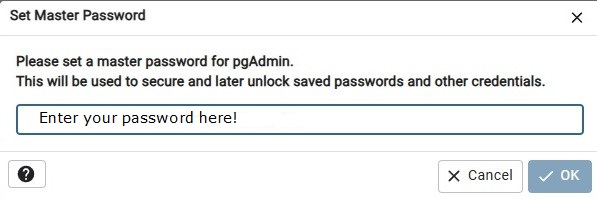
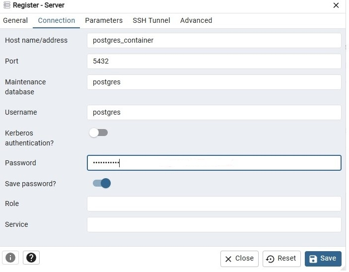

# **Application for Indexing Web Pages and Performing Fast Search**

**This application allows you to index web pages and perform fast search on them. The search engine is developed on the
Spring framework and works in a multi-threaded mode, visiting all website pages starting from the homepage.**

## **Installation**

**To run the application, you need to follow these steps:**

### Steps to Install and Run the Application

* **Step 1: Install Docker**
    + Run the following command in the terminal: `docker-compose -f docker/docker-compose.yaml up`
* **Step 2: Open Browser**
    + Open a browser and enter the search query: `http://localhost:5050/browser/`
* **Step 3: Enter Password**
    + Enter the password as shown below:
        - 
* **Step 4: Create PostgreSQL Server**
    + Create a PostgreSQL 16 server as shown below:
        - 
        - 
        - 
* **Step 5: Create Search Engine Schema**
    + Create the `search_engine` schema as shown below:
        - 
        - 
* **Step 6: Run Application**
    + Run the application
* **Step 7: Enter URL**
    + Enter the URL `http://localhost:8080/` in the browser address bar

## **Contributing**

**If you would like to contribute to this project, please follow the guidelines in the CONTRIBUTING.md file.**

## **Contact**

**If you have any questions or issues, please contact me
at [Ozsfag3154artem@gmail.com](mailto:Ozsfag3154artem@gmail.com).**